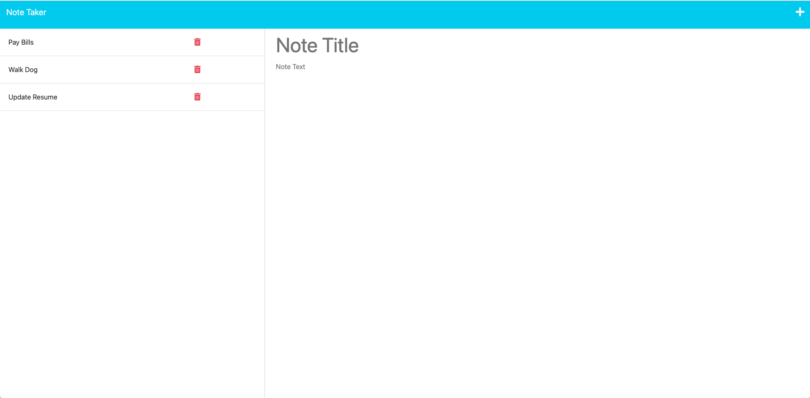

# Note Taker App - Utilizing Express Back End

## Description
  - This application uses JavaScript, HTML, CSS and utilizes Express.js as a Node.js web application framework for the back end to create a web based note taker application.  The code is structured in modular format with api routes and html routes in separate directories. Note information is stored as objects in an array in json format.  The application also makes use of helper functions which are called insided the various api routes.

## Table of Contents
  [Installation](#installation)

  [Usage](#usage)

  [License](#license)

  [Contributing](#contributing)

  [Tests](#tests)

  [Questions](#questions)
  
  ## Screenshot of Deployed Application

  

  ## Installation
  - In order to run the app, the user should clone this repository to their local device then run npm init followed by npm install in the integrated command line from the root of the directory.  That will set up the proper package.json file and install the necessary packages.
  ## Usage
  - This application helps the user to digitally store and save notes by entering a note title and note content.  The user can then refer to each note in the saved notes column by referencing the each note's title.  The user may also edit and delete notes from the same list. Once the proper packages are installed, the user may start the app by running node server from the integrated command line and opening the browser to localhost:3001.
  ## Contributing
  - Developers are welcome to contribute to this project by cloning this GitHub repository to their local device.  One potential area of expansion is to further deconstruct the apiRoutes into separate modular files beyond the index.js where all api routes are currently housed.
  ## Tests
  - Currently no tests are available or required to run the application.
  ## Questions
  - Please visit my GitHub profile for further information about his project (https://github.com/AltB22)
  - Please email Please contact William Massie at the following email address: altbcodes@gmail.com with additional quesitons.
  ## License
  - This application is covered under the MIT license

  